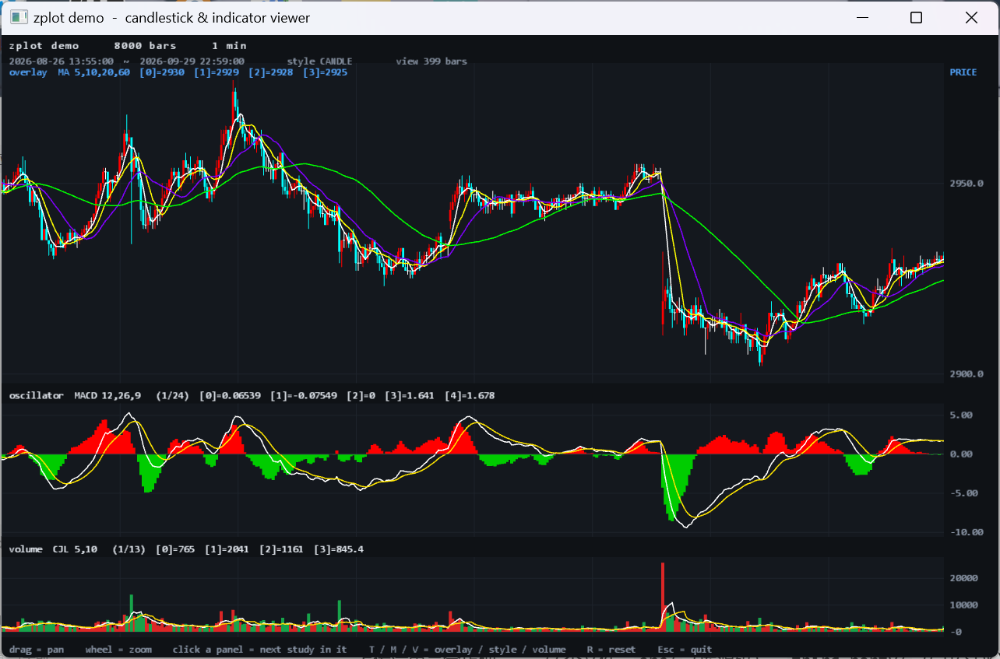

# zplot

A small, dependency-free C++20 library that turns OHLC bars into **triangle vertices** and
computes **technical indicators** — oscillators, trend studies and volume / open-interest
studies. It draws nothing by itself: it produces geometry, and you hand that geometry to
whatever renderer you already have.

The bundled demo does exactly that with plain Win32 and an OpenGL 4.6 core profile —
no GLFW, no SDL, no Qt, no FreeType. The only third-party code anywhere is
[glad](https://glad.dav1d.de/) in the demo, vendored to load the GL entry points.



## Status

- **Charting + indicators**: stable, used in production by the author. 55+ indicators,
  matched item-by-item against the reference formulas of Chinese trading terminals.
- **Demo**: complete and self-contained — builds and runs out of the box from a fresh clone.
- **CTP wrapper**: **not in this repository** (see the Chinese section at the end).

---

## Why it exists

Charting code usually arrives welded to a rendering framework. zplot is the part that is
actually about charts: bars in, triangles out.

- **Zero dependencies.** Standard library only. The library never links a graphics API.
- **Renderer-agnostic.** Output is a flat `std::vector` of `{x, y, r, g, b, a}` vertices laid
  out as triangles. Upload it to a vertex buffer and draw. The demo's whole render path is
  one shader and one `glDrawArrays` per panel.
- **Two-stage API.** `Compute*` returns *data-space* series plus the value range; geometry
  helpers map those to pixels and triangulate them. The range has to be known before a
  viewport can be configured, so the indicator is computed once and consumed twice.
- **Bars in, nothing out.** Input is a plain `std::vector<zplot::Bar>`. Build it from a CSV,
  a socket, or a live exchange callback — zplot performs no I/O for you.
- **Indicators that match a real terminal.** Definitions, periods and units are matched item
  by item against the reference formulas of the same name, including the unit traps
  (`DDI` / `SRDM` / `ADTM` return a `-1 ~ +1` ratio, not a percentage). See
  [`docs/indicators.md`](docs/indicators.md) for the full list and the match results.

## What is in the box

| Area | Contents |
|---|---|
| Candlesticks | candles (hollow up / solid down), bamboo (OHLC bars), close line, tower |
| Oscillators | `MACD` `KDJ` `KD` `ROC` `RSI` `SLOWKD` `WR` `BIAS` `CR` `ATR` `DMI` `CCI` `PSY` `MTM` `DDI` `DMA` `ADTM` `ARBR` `LON` `SRDM` `SHORT` `MI` `DPO` `ASl` |
| Trend | `BOLL` `MA` `SAR` `SAR1` `PUBU` `SP` `SMA` `EMA` `HCL` `MIKE` `BBI` `DKX` `EMA2` `BBlBOLL` `CDP` `ENV` `TRMA` `TSMA` and more |
| Volume / OI | `CJL` `MV` `CCL` `OPI` `OBV` `VR` `AD` `PVT` `WAD` `WVAD` `VOSC` `VROC` `VRSI` |
| Geometry | viewport mapping, and triangulation of rectangles, thick segments, polylines, bars and scatter points |

## Repository layout

```
zplot/
├── include/                  the entire public API (8 headers)
│   ├── ZeBar.h               the input bar (OHLC + volume + open interest)
│   ├── ZePlotTypes.h         the vertex / text data contract
│   ├── color4f.h             RGBA color value type
│   ├── ZePlotGeometry.h      viewport mapping + triangulation helpers
│   ├── ZeKLineChart.h        candles, bamboo, close line, tower
│   ├── ZeOscillatorIndicator.h
│   ├── ZeTrendIndicator.h
│   └── ZeVolumeIndicator.h
├── src/                      charting + indicator sources (MIT, fully open)
│   ├── ZeKLineChart.cpp
│   ├── ZeOscillatorIndicator.cpp
│   ├── ZeTrendIndicator.cpp
│   └── ZeVolumeIndicator.cpp
├── demo/                     Win32 + OpenGL 4.6 viewer
│   ├── main.cpp              the whole application
│   ├── ZeOpenGL.h            WGL bootstrap: create a 4.6 core context
│   ├── ZeTextRenderer.h      GDI glyph atlas -> GL texture -> text quads
│   └── glad/                 vendored OpenGL loader (glad 0.1.36, gl=4.6 core)
├── tools/
│   ├── tq_fetch_kline.py     fetch minute bars into the demo's CSV format
│   └── data/                 a sample 1-minute dataset
├── docs/
│   ├── screenshot.png
│   └── indicators.md         indicator formulas, params, and terminal-match results
└── CMakeLists.txt            builds the library and the demo
```

There are **no prebuilt binaries in this repository** — the demo compiles `src/*.cpp`
from source, so a fresh clone builds and runs without downloading anything.

## Quick start

```cpp
#include <ZeBar.h>
#include <ZeKLineChart.h>
#include <ZeOscillatorIndicator.h>
#include <ZePlotGeometry.h>

std::vector<zplot::Bar> bars = LoadYourBars();     // index must start at 0 and be gap-free

// 1. compute once -- data-space series plus the value range
zplot::SeriesPlot macd = zplot::ComputeOscillator(bars, "MACD", { 12, 26, 9 });
if (!macd.valid) { /* unknown name, too few parameters, or not enough bars */ }

// 2. configure a viewport from that range
zplot::Viewport vp;
vp.left = 0.0f;  vp.top = 0.0f;
vp.width = 800.0f; vp.height = 300.0f;
vp.xMin = 7600.0f; vp.xMax = 7999.0f;              // bar indices, shared with the candles
vp.yMin = macd.yMin; vp.yMax = macd.yMax;

// 3. triangles out
std::vector<Kit::PlotVertex> verts;
zplot::AppendSeries(verts, macd, vp);              // the indicator
zplot::AppendKLine(verts, bars, priceViewport, {});// the candles, same x range -> aligned

UploadToGpu(verts.data(), verts.size());           // 24 bytes per vertex, no index buffer
```

The default palettes are tuned for a **dark** canvas. On a light one, call
`plot.DimForLightBackground()` once after computing — it darkens the grey/white strokes and
leaves saturated colors alone.

## Building the demo

```bash
cmake -B build
cmake --build build --config Release
```

The `zplot` static library and the `zplot_demo` executable are both built from source —
the demo compiles `src/*.cpp` and links nothing but the Win32 system libraries, so a
fresh clone builds and runs out of the box. On Windows with the Visual Studio toolset
installed, CMake picks the generator automatically; run `cmake --build build` from a
developer prompt (or pass `-G "Visual Studio 18 2026"` explicitly) if needed.

The demo takes an optional CSV path as its first argument, otherwise it looks for
`CZCE_MA701_1min.csv` next to the executable and then under `tools/data/`.

### Demo controls

| Input | Action |
|---|---|
| left-drag | pan the horizontal axis |
| left click | cycle the study shown by the panel you clicked |
| right click | reset the view |
| wheel | zoom around the cursor |
| `T` / `M` / `V` / `O` | next trend overlay / chart style / volume study / oscillator |
| `R` / `Esc` | reset the view / quit |

### Data format

`datetime,open,high,low,close,volume,open_oi,close_oi[,settle]`

The header row is skipped. Column 9 (settlement) is optional and falls back to the close,
so settlement-driven studies never degenerate into an empty chart.

## Requirements

- Windows, x64
- CMake 3.20+ and a C++20 compiler — developed and tested with MSVC on
  Visual Studio 2026 (toolset v145)
- An OpenGL 4.6 driver for the demo
- No third-party libraries at all; the demo vendors glad

## Third-party code

| Component | Where | License |
|---|---|---|
| glad 0.1.36 (OpenGL 4.6 core loader) | `demo/glad/` | MIT / public domain |

## License

The charting and indicator code in `include/` and `src/` is **MIT** — see
[LICENSE](LICENSE).

---

# 中文说明：CTP 交易接口封装

**这个仓库里不含 CTP 封装 —— 图表与指标是开源的，CTP 那一层不开放。**

zplot 的图表 / 指标部分完全开源（MIT）。除此之外，作者另有一层对上期技术 CTP
交易 / 行情接口的 C++ 封装，把 `CThostFtdcTraderApi` / `CThostFtdcMdApi` 的裸指针、
回调与 GBK 字符串收进一个值语义的接口里（登录、结算单、报单、撤单、成交、持仓、
行情订阅，以及自动 GBK → UTF-8）。**这层封装不随仓库发布，仅通过闲鱼提供。**

如果你需要 CTP 行情 / 交易对接，请到闲鱼联系作者，可以**免费提供**（封装好的
预编译库 + 头文件 + 使用说明）：

> 闲鱼搜索 **`火山口小小的灯笼鱼`**，说明来意「zplot CTP 对接」即可。

这层封装基于 **CTP API v6.7.11**（x64，se 流，`20250617_traderapi64_se_windows`）。
CTP 官方分发包（`thosttraderapi_se` / `thostmduserapi_se` 的 `.lib` 与 `.dll`）需要你
自己向期货公司 / 上期技术获取，作者不代发。

---

# Support & custom work / 定制服务

zplot 是 MIT，免费的部分永远不会收费；issue 和 PR 永远欢迎。

需要基于它做具体事情的话（把 Pine Script / 通达信公式的指标移植过来、把图表接进
交易终端、CTP 行情与交易对接、指标口径对数），我可以接小单，两个入口：

**🧑‍💻 [Fiverr](https://www.fiverr.com/zhangrenze/build-a-custom-kline-candlestick-chart-for-your-app)**
— for international clients: custom K-line chart widgets, indicator porting,
C++ integration. Clear packages, fast turnaround, in English.

**【闲鱼】** 国内客户在闲鱼 App 搜索 **`火山口小小的灯笼鱼`**（最稳的入口）；
或点 [这里](https://m.tb.cn/h.8DqIIxg?tk=826LTof39nl) 打开（PC 上可能跳下载页，建议用手机闲鱼）。
**CTP 对接走这条渠道**（见上一节）。

**可接**：指标移植（Pine / 通达信 / 文华 → C++ / Python / MT5）、K 线控件集成、
指标口径对数、图表与交易终端界面开发、CTP 行情与交易对接（**仅闲鱼渠道**）。

**不接**：代客操盘、收益分成、信号推荐，以及任何形式的投资建议。

> 金融类软件的**开发**和**投资建议**是两回事：前一条我接，后一条碰都不碰。
> 那不只是平台风控，是法律红线。

*I build charting software; I do not give trading advice. For international contract
work, the Fiverr gig above is the fastest way to start — packages, pricing and delivery
times are all up front. Chinese clients: use the Xianyu shop above.*
